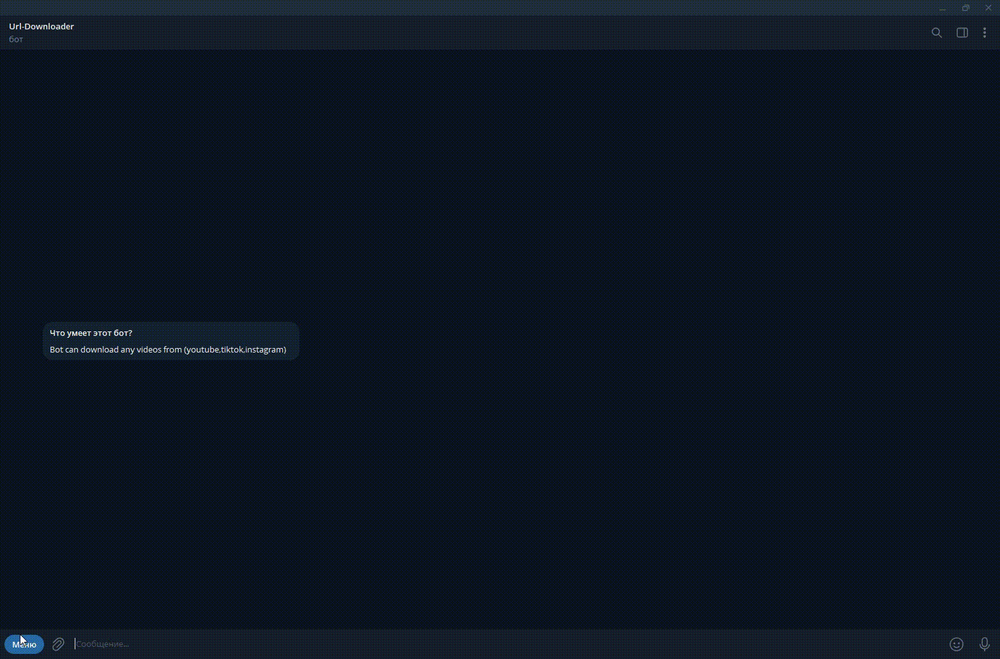

# Telegram Downloader Bot

A Telegram media downloader built with Python.

## Features

🎬 Video Download
- YouTube
- Instagram
- TikTok
- Others

🎵 Music
- Audio extraction
- Music recognition
- Full-song search

⭐ Premium
- Telegram Stars payments
- Premium plans
- Increased limits
- Larger file sizes

👑 Admin Panel
- User management
- Premium management
- Statistics
- Revenue information

⚙️ Engineering
- Async processing
- yt-dlp
- FFmpeg
- SQLite
- Request IDs
- Rate limiting
- Concurrent download control
- Automatic cleanup
- Error handling

## Architecture

-Telegram
-    ↓
-Handlers
-    ↓
-Services
-    ↓
-Downloaders / Processors
-    ↓
SQLite

## Demo

## Technical Highlights

### Request isolation
Each download receives a unique request ID so multiple simultaneous
requests from the same user don't overwrite each other.

### Async downloads
Blocking yt-dlp operations are moved away from the Telegram event loop.

### Premium system
Premium subscriptions are handled through Telegram Stars.

## Commercial Version

The complete source code is available separately on Gumroad link is below .

Link:http://shokhhhh.gumroad.com
